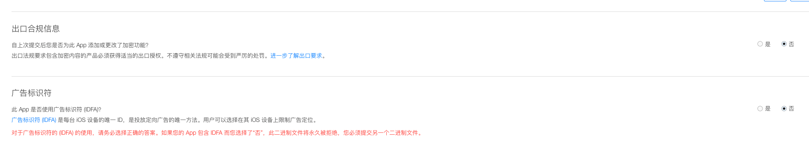

____

#广告勾选错误被拒,一妹纸提交审核的时候,苹果问是否有广告,结果这妹纸想以后可能有广告,勾选了,结果被拒了    

**苹果邮件描述** 苹果被拒邮件内容： We found that your app uses the Advertising Identifier but does not include ad functionality. This does not comply with the terms of the Apple Developer Program License Agreement, as required by the App Store Review Guidelines. Specifically, section 3.3.12 of the Apple Developer Program License Agreement states: ”You and Your Applications (and any third party with whom you have contracted to serve advertising) may use the Advertising Identifier, and any information obtained through the use of the Advertising Identifier, only for the purpose of serving advertising. If a user resets the Advertising Identifier, then You agree not to combine, correlate, link or otherwise associate,  either directly or indirectly, the prior Advertising Identifier and any derived information with the reset Advertising Identifier." If your app is serving ads, please: - Ensure that you have tested your app on a device, not just the simulator, and that you have removed all previous versions of your app prior to testing - Provide us the steps to locate ads in your app If your app does not serve ads, please check your code - including any third-party libraries - to  remove any instances of: class: ASIdentifierManager selector: advertisingIdentifier framework: AdSupport.framework If you are planning to incorporate ads in a future version, please remove the Advertising Identifier from your app until you have included ad functionality. To help locate the Advertising Identifier, use the "nm" tool. For information on the "nm" tool, please see the nm man page. If you do not have access to the libraries' source, you may be able to search the compiled binary using the "strings" or "otool" command line tools. The "strings" tool lists the methods that the library calls, and "otool -ov" will list the Objective-C class structures and their defined methods. These  techniques can help you narrow down where the problematic code resides.

##解决方案: **app没有做广告,是否有广告的勾,就不要打勾了如图片中所示,重新上传!** 就可解决 

____