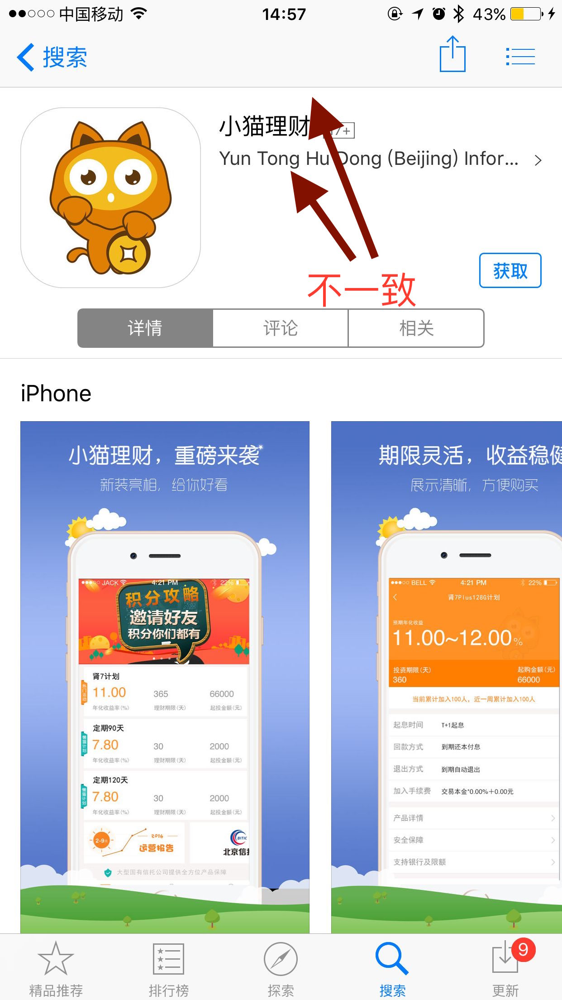
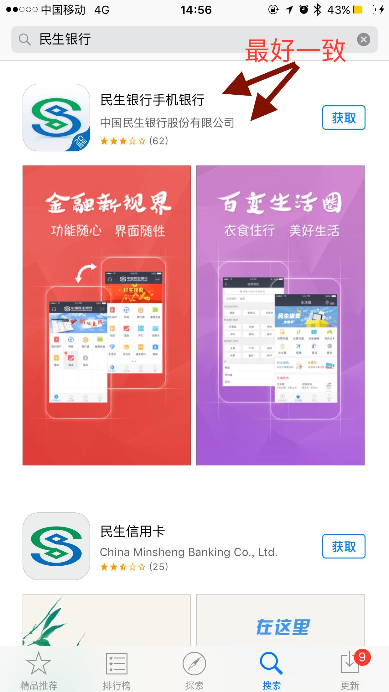

____
#📣问题:app崩溃(Crash)问题

**苹果邮件描述** 
##描述一
The Vendor Email (xxxxx@gmail.com) associated with your app do not reflect the name, “xxxxxxx Co., LTD.,” in the app or its metadata, as required by section 1.2 of the Apple Developer Program License Agreement. 

Next Steps 

Your app must be published under a Seller name and Artist name that reflects the xxxxxx Co., LTD. brand. If you have developed these apps on behalf of a client, please advise your client to add you to the development team of their Apple Developer account. 

The Seller name is your Vendor Content Provider name in iTunes Connect. For information on how to address this issue, please contact Developer Program Support or by phone. 

The Artist name is the Company name in iTunes Connect. For information on how to address this issue, please contact iTunes Connect Contact Us.

##被拒描述二
PLA 1.2

The Vendor Email, Support URL, and/or Seller and Artist names associated with your app do not reflect the name, “中金恒信,” in the app or its metadata, as required by section 1.2 of the Apple Developer Program License Agreement.

Next Steps

Your app must be published under a Seller name and Artist name that reflects the 中金恒信 brand. If you have developed these apps on behalf of a client, please advise your client to add you to the development team of their Apple Developer account.

The Seller name is your Vendor Content Provider name in iTunes Connect. For information on how to address this issue, please contact Developer Program Support or by phone.

The Artist name is the Company name in iTunes Connect. For information on how to address this issue, please contact iTunes Connect Contact Us.

##被拒描述三
PLA 1.2

The Vendor Email, Support URL, and/or Seller and Artist names associated with your app do not reflect the name, “小猫理财,” in the app or its metadata, as required by section 1.2 of the Apple Developer Program License Agreement.

Next Steps

Your app must be published under a Seller name and Artist name that reflects the “小猫理财” brand. If you have developed these apps on behalf of a client, please advise your client to add you to the development team of their Apple Developer account.

The Seller name is your Vendor Content Provider name in iTunes Connect. For information on how to address this issue, please contact Developer Program Support or by phone.

The Artist name is the Company name in iTunes Connect. For information on how to address this issue, please contact iTunes Connect Contact Us.
##被拒绝描述四
Chinese name don't have much meaning, just a name, is comprised of several unrelated characters, not like hussein Obama means change.

2016年10月19日 上午9:36

发件人 Apple

0. 10.0 BEFORE YOU SUBMIT: PROGRAM LICENSE AGREEMENT

PLA 1.2

The Vendor Email, Support URL, and/or Seller and Artist names associated with your app do not reflect the name, "RF Pay," in the app or its metadata, as required by section 1.2 of the Apple Developer Program License Agreement.

Next Steps

Your app must be published under a Seller name and Artist name that reflects the RF Pay brand. If you have developed these apps on behalf of a client, please advise your client to add you to the development team of their Apple Developer account.

The Seller name is your Vendor Content Provider name in iTunes Connect. For information on how to address this issue, please contact Developer Program Support or by phone.

The Artist name is the Company name in iTunes Connect. For information on how to address this issue, please contact iTunes Connect Contact Us.

##解决方案:
[Apple Developer Program License Agreement](http://adcdownload.apple.com/Documentation/License_Agreements__Apple_Developer_Program/Apple_Developer_Program_License_Agreement_20160921.pdf),

      
1、Vendor Email(app 提供商的邮箱,最好和app的名字看起来关系),Support UR app的卖主提供的支持网址：(填公司网址即可,金融类的最好填金融类的,比如中国银行最好填中国银行的网址,不要填和中国银行一点关系都没有的外包公司的网址）
2、App中相关的内容一定要体现出公司相关的内容，千万不能让苹果审核者以为你这个App和你们公司没什么关系，那肯定会被拒。
3、把开发者邮箱修改下，里边把名称修改成公司名称
4,Seller and Artist names  卖app的人(免费下载其实也叫卖,0元卖),
____
