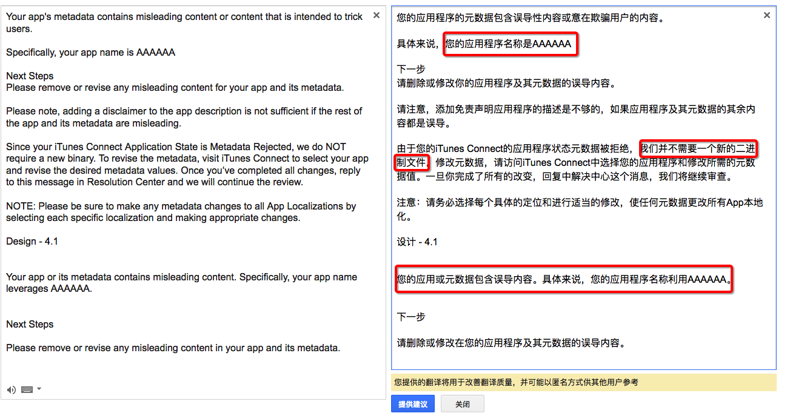

#📣问题:app被拒绝了,如何解决,(问问题之前看看,授人以鱼不如授人以渔)
>笔者奋战在iOS开发一线,遇到app被拒绝的,一般都是一次修改就可以通过审核,我是如何修改的分享给大家,其实很简单,但是很多人(新手)还是不大会怎么去解决app被苹果拒绝的问题

```
如果按照本文的方法google翻译了,还是不会请把你的①苹果拒绝的英文描述,②英文描述的google翻译(不推荐百度) ③苹果拒绝的截图(screenshot) 一定是③样东西(③样东西发出来,别人才能更高效的帮你)发到QQ群,appstore审核问答群①已满,无法加入,请加审核问答②群467449800(欢迎加入群② 人数目前偏少,笔者会更多的在这个群 解答下),让别人帮你看看怎么解决,③样东西少了一样 别人帮你的效率就会降低
```


##教学案例1
###苹果拒绝描述
2016年9月8日 上午6:40
发件人 Apple

    1. 1 SAFETY: OBJECTIONABLE CONTENT
    4. 1 DESIGN: COPYCATS
        
Safety - 1.1.6
Your app's metadata contains misleading content or content that is intended to trick users.

Specifically, your app name is AAAAAA

Next Steps
Please remove or revise any misleading content for your app and its metadata.

Please note, adding a disclaimer to the app description is not sufficient if the rest of the app and its metadata are misleading.

Since your iTunes Connect Application State is Metadata Rejected, we do NOT require a new binary. To revise the metadata, visit iTunes Connect to select your app and revise the desired metadata values. Once you’ve completed all changes, reply to this message in Resolution Center and we will continue the review.

NOTE: Please be sure to make any metadata changes to all App Localizations by selecting each specific localization and making appropriate changes.

Design - 4.1


Your app or its metadata contains misleading content. Specifically, your app name leverages AAAAAA.


Next Steps

Please remove or revise any misleading content in your app and its metadata.

###根据描述如何解决:

上面的内容拿到google 翻译[点击这里去google翻译](https://translate.google.cn/),下面的这个图就是google翻译的,我大致看了下基本上90% 的准确性,翻译还是比较准的,文中的重点红框已经标出,重点如下(按下面的三点继续提交即可)

- 这个程序的名字有问题,
- 不需要提交新的二进制文件 
- 最后还是强调了下是名字的问题

```
如果你google翻译了,还是不会请把你的①苹果拒绝的英文描述,②英文描述的google翻译(不推荐百度) ③苹果拒绝的截图(screenshot) 一定是③样东西(③样东西发出来,别人才能更高效的帮你)发到QQ群,让别人帮你看看怎么解决,③样东西少了一样 别人帮你的效率就会降低
```



