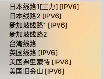
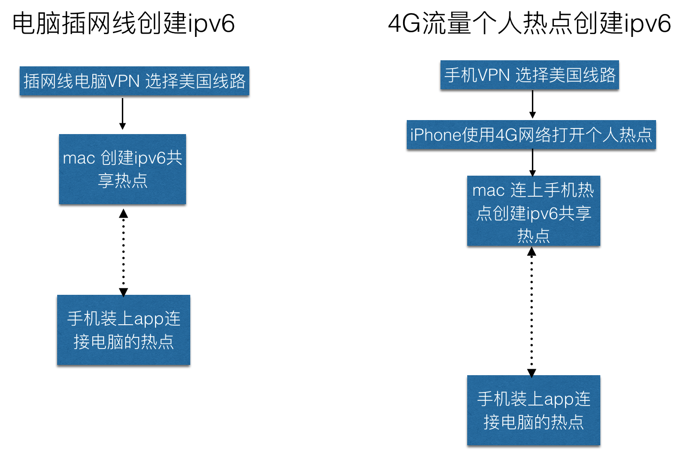

# ipv6审核被拒绝的解决方案
## 目录

 - 1.[苹果ipv6被拒绝邮件描述汇总](https://github.com/wg689/Solve-App-Store-Review-Problem/blob/master/ipv6.md#%E8%8B%B9%E6%9E%9Cipv6%E8%A2%AB%E6%8B%92%E7%BB%9D%E9%82%AE%E4%BB%B6%E6%8F%8F%E8%BF%B0%E6%B1%87%E6%80%BB)

- 2.[如何判断是因为ipv6被拒绝?](https://github.com/wg689/Solve-App-Store-Review-Problem/blob/master/ipv6.md#%E5%A6%82%E4%BD%95%E5%88%A4%E6%96%AD%E6%98%AF%E5%9B%A0%E4%B8%BAipv6%E8%A2%AB%E6%8B%92%E7%BB%9D
)

- 3.[如何适配ipv6?](https://github.com/wg689/Solve-App-Store-Review-Problem/blob/master/ipv6.md#%E5%A6%82%E4%BD%95%E9%80%82%E9%85%8Dipv6
)

- 4.[检查服务器是否支持ipv6及服务器如何修改](https://github.com/wg689/Solve-App-Store-Review-Problem/blob/master/ipv6.md#12%E6%A3%80%E6%9F%A5%E6%9C%8D%E5%8A%A1%E5%99%A8%E6%98%AF%E5%90%A6%E6%94%AF%E6%8C%81ipv6%E8%BF%99%E6%98%AF%E4%B8%80%E4%B8%AA%E5%A4%A7%E9%97%AE%E9%A2%98%E5%95%8A)

- 5.[ipv6多次被拒后的怎么办?自己搭建的ipv6是好的还是被拒绝怎么办?(顺序操作哦)](https://github.com/wg689/Solve-App-Store-Review-Problem/blob/master/ipv6.md#q%E4%BA%8Cipv6%E5%A4%9A%E6%AC%A1%E8%A2%AB%E6%8B%92%E5%90%8E%E7%9A%84%E6%80%8E%E4%B9%88%E5%8A%9E%E8%87%AA%E5%B7%B1%E6%90%AD%E5%BB%BA%E7%9A%84ipv6%E6%98%AF%E5%A5%BD%E7%9A%84%E8%BF%98%E6%98%AF%E8%A2%AB%E6%8B%92%E7%BB%9D%E6%80%8E%E4%B9%88%E5%8A%9E%E9%A1%BA%E5%BA%8F%E6%93%8D%E4%BD%9C%E5%93%A6
)

- 6.[实在搞不定ipv6怎么办?(对ipv6无计可适的时候可以考虑)](https://github.com/wg689/Solve-App-Store-Review-Problem/blob/master/ipv6.md#q%E4%B8%89%E5%AE%9E%E5%9C%A8%E6%90%9E%E4%B8%8D%E5%AE%9Aipv6%E6%80%8E%E4%B9%88%E5%8A%9E%E5%AF%B9ipv6%E6%97%A0%E8%AE%A1%E5%8F%AF%E9%80%82%E7%9A%84%E6%97%B6%E5%80%99%E5%8F%AF%E4%BB%A5%E8%80%83%E8%99%91
)

# 苹果ipv6被拒绝邮件描述汇总
(近2个月苹果审核拒绝的app,据笔者估计ipv6占75%以上,内购占10%,其他占15%)

**被拒的描述1**: From Apple  2. 1 PERFORMANCE: APP COMPLETENESS  2. 3 PERFORMANCE: ACCURATE METADATA  Performance - 2.1   We were unable to review your app as it crashed on launch. We have attached detailed crash logs to help troubleshoot this issue.  Next Steps  Please revise your app and test it on a device while connected to an IPv6 network (all apps must support IPv6) to ensure it will launch without crashing.  Resources  For additional information about supporting IPv6 Networks, please refer to Supporting IPv6 DNS64/NAT64 Networks and Supporting IPv6-only Networks.  For a networking overview, please see About Networking.  For information on how to symbolicate and read a crash log, please see Tech Note TN2151 Understanding and Analyzing iPhone OS Application Crash Reports.  If you have difficulty reproducing this issue, please try testing the workflow described in Testing Workflow with Xcode's Archive feature.  If you have code-level questions after utilizing the above resources, you may wish to consult with Apple Developer Technical Support. When the DTS engineer follows up with you, please be ready to provide:  - complete details of your rejection issue(s)  - screenshots  - steps to reproduce the issue(s)  - symbolicated crash logs - if your issue results in a crash log     **被拒描述2**:  We discovered one or more bugs in your app when reviewed on iPhone running iOS 9.3.4 on Wi-Fi connected to an IPv6 network. At launch, the app crashes or display message as “请检查网络连接”. We've attached screenshot(s) for your reference. Next Steps Please run your app on a device while connected to an IPv6 network (all apps must support IPv6) to identify the issue(s), then revise and resubmit your app for review.   **被拒描述3**  We discovered one or more bugs in your app when reviewed on iPad and iPhone running iOS 9.3.4 on Wi-Fi connected to an IPv6 network.  Specifically,  we were unable to load the video contents. The loading icon kept spinning. No mote further action was taken.   We've attached screenshot(s) for your reference.
  **被拒的描述4** 发件人 Apple 2. 1 PERFORMANCE: APP COMPLETENESS 2. 3 PERFORMANCE: ACCURATE METADATA 2. 4 PERFORMANCE: HARDWARE COMPATIBILITY 4. DESIGN: PREAMBLE Performance - 2.1 We discovered one or more bugs in your app when reviewed on iPhone running iOS 9.3.4 on Wi-Fi connected to an IPv6 network.
  **被拒的描述5**
Performance - 2.1
We discovered one or more bugs in your app when reviewed on iPhone running iOS 9.3.4 on Wi-Fi connected to an IPv6 network.
  **被拒的描述6**
Performance - 2.4.1
We noticed that your app did not run at iPhone resolution when reviewed on iPad running iOS 9.3.4. Specifically, we were not able to log in from an iPad as an error message displayed.
We've attached screenshot(s) for your reference.
aNext Steps
Please revise your app to ensure it runs and displays properly at iPhone resolution on iPad.
Resources
For information on iOS device screen sizes and resolutions, please see the iOS Human Interface Guidelines as well as the Points versus Pixels in the View Programming Guide for iOS.

  **被拒的描述7**
We discovered one or more bugs in your app when reviewed on iPad and iPhone running** iOS 10.0 **on Wi-Fi connected to an IPv6 network.
Specifically, we were unable to login to the app. The loading icon span indefinitely.
We've attached screenshot(s) for your reference.
Next Steps

Please run your app on a device while connected to an IPv6 network (all apps must support IPv6) to identify the issue(s), then revise and resubmit your app for review.
If we misunderstood the intended behavior of your app, please reply to this message in Resolution Center to provide information on how these features were intended to work.
For new apps, uninstall all previous versions of your app from a device, then install and follow the steps to reproduce the issue(s). For updates, install the new version as an update to the previous version, then follow the steps to reproduce the issue(s).
**被拒的描述8**....我见过超过10种以上的描述了,我就不贴了,只要苹果拒绝邮件含有ipv6就需要适配ipv6,就需要搭建ipv6 环境测试自己的app 

## 如何判断是因为ipv6被拒绝?
- 1只苹果的拒绝邮件含有"ipv6"那么你99.5%需要适配ipv6  , 

- 2"NetWork连接失败,无法登陆,无法加载数据"很有可能需要适配ipv6,为什么?中国6.1号之后80%以上的应用被拒绝都是因为ipv6,ipv6导致的问题是无法连接服务器,所以这种情况你也需要考虑是不是应该适配ipv6

- 3我见过超过10种以上的描述了,我就不全贴了,本文末尾有超过6种苹果拒绝的描述,描述不一样, 解决方案都一样,都需要支持ipv6 **只要苹果拒绝邮件含有ipv6就需要适配ipv6,就需要搭建ipv6 环境测试自己的app ,拒绝邮件没有包含"ipv6"但是告诉你网络加载失败,加载不出来,登录就崩溃等现象,**如被拒描述6所示!为啥?被拒描述6所示:"说在9.3.4下无法连接",最近啥问题会导致一大片的app无法连接?ipv6 啊,既然有无法连接的问题,是不是该检查下ipv6 是否ok?下面告诉你如何检查!

## 如何适配ipv6?

### 一)搭建ipv6环境

##### 1.1)搭建ipv6 的测试环境

搭建ipv6 环境,搭建好的ipv6 ,环境会有一个共享wifi, 具体如何搭建ipv6测试环境参考[本地如何搭建IPv6环境测试你的APP,需要网线](http://www.jianshu.com/p/632d995749e1),[iOS-用手机网络测试Ipv6,无需网线](http://www.jianshu.com/p/6c7a155fc372) **如果搭建ipv6 遇到问题,热点连不上,别人教程的选项我没有怎么办?**
多找找 如何搭建ipv6的帖子(我第一次搭建看了好几篇帖子,试了好几种方法,搭建ipv6环境需要的网络可以是插的网线,也可以是wifi),如果都不行[这里有很多如何搭建ipv6 的文章](http://www.jianshu.com/search?q=ipv6+%E6%90%AD%E5%BB%BA&page=1&type=notes),你需要做的是注意一些细节问题,比如苹果系统是10.11.5 以上,测试的手机最好不是iphon5 以下,笔者亲测iphone5连不上ipv6,是个例还是普遍现象有待进一步考证 
**ipv6环境搭建好之后怎么办** 
1️⃣进行测试app之前最好确认好服务器是否支持ipv6(1.2中已告诉你方法了),否则如果你的某个网络请求失败,你怎么去排查问题?请求失败到底是服务器不行还是你的Objective-C代码有问题,这种方法更严谨,时间略多 
2️⃣也有人默认服务器ipv6支持完好,实际上80%以上的用户服务器已经支持好ipv6,少数不支持需要用到1.2中的方法,如果你默认服务器支持良好你可以跳过1.2 ,1.3步骤直接去系统测试你的app 了,实际上很多人这么做app 也上线了.反正现在审核快,不行就拿回来修改再提交,这种不测试服务器的方法不推荐使用,特别是老板很期待版本早日上线的情况下,不要去赌服务器ipv6支持良好!
 
##### 1.2)检查服务器是否支持ipv6(这是一个大问题啊)
笔者公司用的阿里云,6.8号以后项目上线,服务器一行代码也没就修改项目照常上线,自己公司搭建的和其他小服务器厂商需要重点关注下,比如拍云以前就不支持,现在支持了.如果使用第三方服务器请咨询服务器提供商,是否适配ipv6,自己公司的服务器人员需要怎么修改,询问有时候可以快速获得最佳的答案!
 如果搭建的过程中试了无数的方法,ipv6访问app服务器访问不了,你需要测试下你的服务器是否支持ipv6,怎么验证参考这三篇文章中一篇吧!
  [另外这个网址也可以测试ipv6连接是否正常](http://www.subnetonline.com/pages/ipv6-network-tools/online-ipv6-ping.php), [ipv6测试](http://test-ipv6.com) 这2个测试可以进行ipv6 测试 大家可以选其中一个试试,理论上两个链接的测试结果一样
##### 1.3)服务器不支持ipv6,怎么解决(群里面有部分网友问到,此部分内容最好和服务器人员一起研究)
让服务器开发人员修改到上面的测试ipv6通过为止,如果服务器不会修改怎么办?找专业的人员帮忙,有可能需要购买中专服务,本解决方案的花钱找人帮忙部分有介绍.[关于ipv6审核给你点借鉴](http://my.oschina.net/u/872517/blog/728827)此文介绍了一些服务器如何适配ipv6,需要添加aaaa中转,这种中转有付费和免费的,详情见链接原文!更多关于ipv6的原理,服务器如何支持ipv6,如何花钱让别人使你的服务器是否支持ipv6,请参考[这篇文章](http://mp.weixin.qq.com/s?plg_nld=1&plg_uin=1&mid=2247483863&idx=1&plg_nld=1&scene=23&plg_auth=1&__biz=MzI0NTI4ODA2Mw%3D%3D&plg_dev=1&srcid=0701GkquSx0l7Z6CchTAHFFn&plg_usr=1&plg_vkey=1&sn=622478d2775c5f8835fe1ed16964552e#rd)   [CentOS开启IPV6支持，he.net免费隧道方案](http://cuelog.com/archives/541.html),这篇文章介绍了如何查看阿里云是否支持ipv6,CentOS开启IPV6支持，he.net免费隧道方案这篇文章只懂iOS的忽略,请发给公司的服务器人员,这篇文章的内容只适合懂服务器的人员参考.

##### 1.4)用VPN在美国的线路访问服务端(增加通过率的小招,80%左右的app不需要这一步依然可以正常上架,被拒绝了后才推荐这一步)
理论上上面这些解决方案就足够了,下面的方案不用看了,但是为了通过率再提高提高,实际上上面这些做了还是会有很大的概率被拒绝!为了增加通过率**建议**:用VPN在美国的线路访问服务端试一试,因为有些人在自己搭建的ipv6下可以请求数据,但是在美国的线路访问服务端IPV6无法连接,我知道的有超过5位网友遇到过VPN下美国的线路无法连接服务器,不适用VPN 测试的ipv6 是可以正常连接的.

##### 1.5)提供可以在ipv6下 可以ping成功的网址:

www.solve6.com (可以ping成功)

### 1.4)app连上搭建好的共享wifi测试你的app,每个界面都点一下!
_____

app连上搭建好的共享wifi测试你的app,会发现某些 模块无法连接网络, 更换相应的模块即可,**让测试人员把所有的模块功能都点一下,最好在搭建好的ipv6下使用iOS9.3.0以上的系统测试,苹果审核使用iOS9.3.0以上的系统审核**,这样就会某些模块网络出现无法联网的异常或者崩溃,你按照下面的几个步骤进行适配ipv6
##### 1.4.1)更换第三方SDk 
需要更换那些SDK 可以参考我的博客 [适配IPV6需要替换的第三方SDK](http://www.jianshu.com/p/afc0b19fd5d3)  
如果你的友盟,shareSDk是6.1号之前集成的,一定要去更换这些SDK,6.1号后,各个SDK提供商(友盟,环信等等)陆续出了最新的SDk适配ipv6 
##### 1.4.2)比较老的网络请求函数(http请求) 
 比如使用ASI或者AFN的版本太低,使用最新的AFN即可解决问题 
  **注意确认:ipv6 搭建连接是否正确 ?所有功能是否在ipv6下都测试了,app安装在iphon6 以上的机器测试,iphon5 可能连不上ipv6 wifi,搭建ipv6 可以使用mac连接网线和mac连无线,两种方法都可以试试,** 

##### 1.4.3)socket请求适配ipv6(没有用到socket的同学忽略此条)
QQ群很多同学问socket如何适配ipv6?先科普下什么是socket,socket就是和服务器保持长链接,在聊天,直播弹幕,如果你的socket用的第三方比如:环信,融云,leenCloud等 这种第三方的适配超级简单更换最新版的SDK就行.更换SDK的注意事项参考我的博客[环信SDK更换1小时搞定](http://www.jianshu.com/p/d3d77e089489),注意点:更换SDK前咨询技术客服让你少走弯路,具体原因参考我的博客,这是我的经验之谈.如果你的socket没有用第三方,纯自己写的去适配ipv6,其实也是有办法的,我给你提供几个链接参考:[http://www.jianshu.com/p/a6bab07c4062](http://www.jianshu.com/p/a6bab07c4062),这是网易的某大牛写的,[IPV6的配置](http://www.jianshu.com/p/f3af0de54e76),[ipv6总结](http://www.jianshu.com/p/c106f6256c64)更多文章参考这里[更多文章](http://www.jianshu.com/search?q=socket+ipv6&page=2&type=notes),这几篇文章看完,我相信你对如何适配socket会有一个大致的了解!
##### 1.4.4) 在ipv6下 哪里网络连接失败就换或者改代码

### 1.5) iOS10 下面 ipv6被拒绝怎么办?
约9.10号之前,苹果审核人员对ipv6测试都是使用iOS9.3.5 左右的版本进行测试,最近iOS10 横空出世,苹果审核人员使用iOS10 的系统进行ipv6测试,如果app 在iOS10下因为ipv6被拒绝了,你需要下载最新的xcode8 (正式版,非beta版,4个G 网速好20分钟可以下完,xip的文件需要解压) [xcode8 苹果官网下载链接](https://developer.apple.com/download/),同时手机升级到最新的iOS10 ,按照本文提供的教程搭建ipv6环境(搭建ipv6环境和xcode,iOS系统版本无关),对你的app在iOS10 的ipv6 下所有功能和界面进行测试,看看app 的功能是否完好,其他的如何修改和本文提供的方法一样,哪里不行改(换)哪里.

## Q:(二)ipv6多次被拒后的怎么办?自己搭建的ipv6是好的还是被拒绝怎么办?(顺序操作哦)
____
如果你的应用已经搭建过ipv6测试环境并且测试修改过,那么你就按照下面的方法解决,如果从来没做过ipv6适配,请参考本方案的开头部分如何适配ipv6,上面的操作完了再继续来这里继续阅读
 
##### 2.1)措施1
- 0)推荐服务器人员验证(把下面两篇文档发给服务器人员)
   
   [针对苹果官方ipv6审核的综合解决方案](http://www.jianshu.com/p/1223d2ad6f30)

  [用尽洪荒之力解决Apple Store ipv6审核通关---linux服务器支持ipv6](http://www.jianshu.com/p/f0761d51a202)

- 1)用VPN在美国的线路访问服务端试一试,VPN推荐[鱼摆摆](https://ybb1024.com/),9块钱一个月,有群友可以通过鱼摆摆在VPN美国线路下访问自家的app,虽说鱼摆摆自家的客服说不行
有些人在自己搭建的ipv6下可以请求数据,但是在美国的线路(审核人员)访问服务端IPV6无法连接,可能是有些服务器开启了防火墙对国外的IP禁止,或者服务端需要添加AAAA或者需要购买ipv6中装服务,我知道的有超过5位网友遇到过:"VPN下美国的线路无法连接服务器,不用VPN "测试的ipv6 是可以正常连接的现象"的".这里有问题你就修复这里的问题重新打包ipa提交,不是Reply哦!,很多人问VPN下选择美国线路搭建ipv6热点怎么弄,我画了一个图,如果你用下面的流程图搭建的ipv6热点,最新版QQ,微信都无法联网,那么搭建的ipv6热点就是有问题的(有些VPN不支持ipv6),否则搭建的热点是没问题的.

搭建VPN美国线路下ipv6的测试环境步骤
- 1.按照本文提供的测试文档搭建ipv6测试环境,wifi上有箭头,手机的DNS是冒号隔开的,另外你搭建的测试环境至少要保证qq,微信通信正常

- 2.环境搭建好后如果使用的网线,需要安装鱼摆摆(推荐)或者其他的VPN(没用过),需要在鱼摆摆的设置->ipv6 _>菜单显示线路是否支持ipv6,优先使用ipv6 这两个选项勾选才会出现下面的图片所示

 

- 3.选择美国线路,手机连上ipv6热点进行测试,**ipv6热点很不稳定有时候明明搭建好了,wifi上有箭头,手机的DNS是冒号隔开的,整个手机所有app都不能联网,这种情况你就需要多试几次搭建的过程或者换环境(公司不行,回家试试,这台电脑不行换同事的电脑,这个网线不行换个网线试试,笔者在家搭建的ipv6链接顺畅,公司搭建的ipv6各种问题)**

 

- 4上面步骤做完就可以在VPN美国线路下测试ipv6

##### 2.2)措施2
措施1中的在VPN下使用美国的线路测试发现ipv6访问服务器一切正常,苹果那边说你没适配ipv6,你拍个视频给审核人员[详情参考这个链接,有详细例子如何拍视频,点击查看](http://www.cocoachina.com/bbs/read.php?tid-1684531.html),[如何录制视频的样例,有几位按照这个录制顺利通过审核](http://v.qq.com/x/page/i03059ch09b.html),最近被人咨询的比较多的问题我回答下:
 **问题:如何拍视频啊?**
答:拿个安卓或者iOS手机拍摄.个人觉得不应该是录制屏幕,录制屏幕不能很好的反映出你适配ipv6的过程
 **问题:怎么拍**
答:先拍你搭建环境的过程,ipv6环境搭建好了,wifi有箭头吧,ipv6 的DNS是:隔开的,iPv4 的DNS
 是隔开的,手机正确连接电脑wifi的过程也需要拍摄的,这些标志你搭建ipv6环境搭建成功的画面都需要
拍,在拍的时候把自己的app所有界面(都可以加载数据)运行良好的状态拍一下
 **问题:拍好的视频怎么传给苹果审核人员?**
答:拍好的视频传到youtwobe,(不推荐传到优酷,万一美国的审核人员没有耐心等待你的视频加载,又给你打回来
了,美国访问中国的网速会比中国访问中国的网速要慢) 如果你重新提交新版本,就把链接贴在备注的描述
下,平时在这个描述里写这个app.如果你的app 你觉得没任何问题,不想再上传ipa包,登录苹果开发者账号
找到苹果拒绝的描述,这个描述是可以回复的(Reply),在这个Reply里面贴上你的视频链接,写上大致意思
是:"我真的适配了ipv6,我把适配和测试过程都排了,麻烦你再审一遍"的话,说话一定要诚恳,礼貌,说话一定要诚恳,礼貌,说话一定要诚恳,礼貌,(重要事说三遍)如果是2016年5月以前申诉比重新提交节省4-5天的时间重新进入审核,现在申诉和重新提交进入再次审核的时间区别不大,所以选择重新提交和
Reply 都可以!
##### 2.3)措施3
大部分是不需要措施3的,上面的这些做了还是被拒绝怎么办,措施1试过,措施2也试过,还是不管用,我只能建议你继续提交了,stakeoverflow上面有人说,自己测试了都是没问题,怎么苹果还是拒绝,苹果的工程师告诉他你就继续提交吧,这是审核人员的bug,其实这种情况国内的开发者(包括笔者)也遇到过,你明明提供了app的测试账号,他说你没提供,你回复下就好了!他们人工审核也会有失误的时候,只是这个失误被你碰到了!这就是为什么有部分网友啥都没修改,只是在拒绝的描述哪里reply 一下就通过了.

 **问题:被拒绝后我是Reply还是重新提交呢**
 Reply:是指在开发者中心的苹果拒绝描述的哪里,可以回复苹果,那里是reply
重新提交:重新填写版本号,重新填写信息,点击提交以供审核按钮.
当你修改了应用的内容的时候,比如修改了代码,修改了版本号,必须重新提交,提交最好让版本号增加,提交审核网页的中间部分还需要选择你上传的ipa,如果没做任何修改就Reply 一下.

## Q:(三)实在搞不定ipv6怎么办?(对ipv6无计可适的时候可以考虑)
____
如果上面的的方案都不能解决,OC或者swift代码部分还是需要各位开发者自己解决,服务器无法解决,你就需要下面专业的人帮你了,好像要收费啊,收费好,既然收了你的钱,人家肯定得有技术支持教你怎么适配吧,当免费方案都不能解决的时候,我只能劝你花点小钱让专业的人员帮忙了,6box肯定有发票吧,买了服务把发票给老板报! 先花299买个7天的服务把app搞上线, 作为公司几百块钱相对于app 能上线是小case!!
[【链接】转给您身边苹果开发者，IPv6被拒如何破？](http://url.cn/2GGkPA5)这是一篇6box很好的教程!屡次被绝拒绝的,可以看看这篇教程!
[IPv6解决办法：](http://www.solve6.com) 专门解决ipv6问题的的网站,**6box专门解决ipv6被拒的问题**推荐下,你付了费给6box,我拿不到任何报酬,我之所以推荐他们是因为他们的服务能帮助开发者,能解决开发者的痛点! 
**说了这么多其实可以用一句话总结本方案:
1)先搭建环境
2)确保服务器支持ipv6
3)再把每个界面点一下,观察所有的网络是否有异常,哪里有问题换哪里!,自己实在搞不定就花钱找人帮忙 **
## (四)总结
致此,最全面的ipv6 解决方案诞生了,希望可以帮到大家,喜欢请star,转发!如果本文看了三遍还无法解决你的ipv6问题,请私聊审核问答群的群主,群主(我)1对1帮你解答!就是这么有爱心,哈哈(前提是star要给力喔)!

