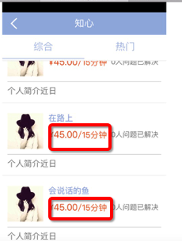
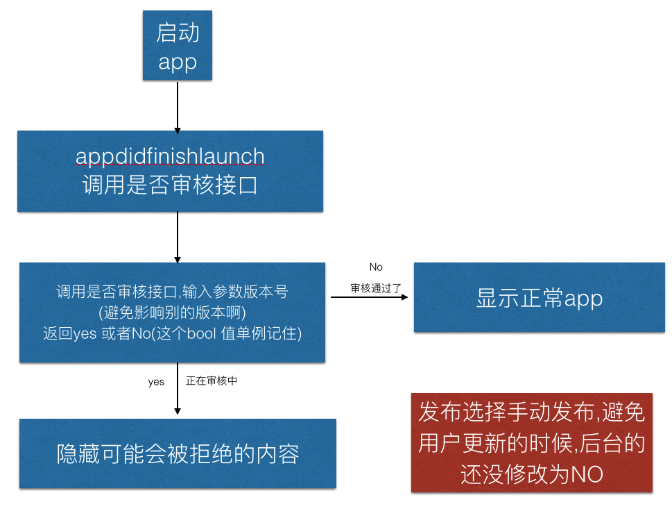

____

#📣问题:有objectionable(反感的讨厌的) and offensive(不愉快的)被拒绝

**苹果邮件描述** 
Your app includes content that many users would find objectionable(反感的讨厌订单) and offensive(冒犯).
Specifically, your app facilitate paids(付费) companionship(陪同 伙伴) which is not appropriate for the App Store.
We've attached screenshot(s) for your reference.
Please remove all objectionable content from your app and submit your revised binary for review. 
苹果截图

  

##解决方案:
看到上文的汉字和红色箭头大致知道什么问题了
苹果认为付费陪玩不符合苹果审核指南

解决方案:上图中的45元/15分钟  调用后台接口,当在审核的时候隐藏

____

____

#📣问题:如何隐藏部分功能
每次app 登陆掉一个接口 返回yes 或者no

**有的公司设个时间,超过了一定的时间比如7天后,某个界面的功能才正常显示,否则这个界面就隐藏部分内容,这样没有接口控制灵活不推荐**
这种隐藏普遍被使用,一经被苹果发现会被警告或者被封开发者账号,有公司隐藏被发现的
____
